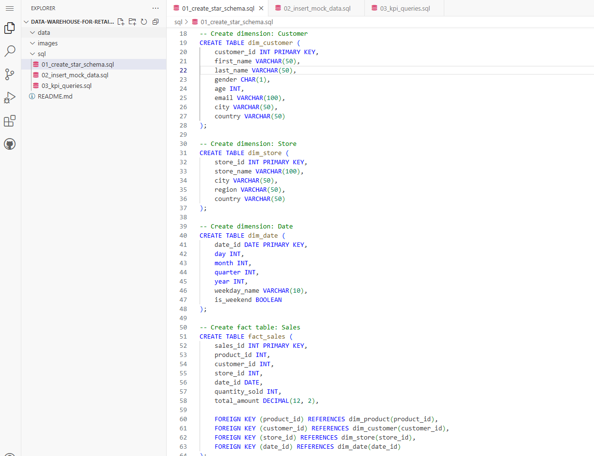
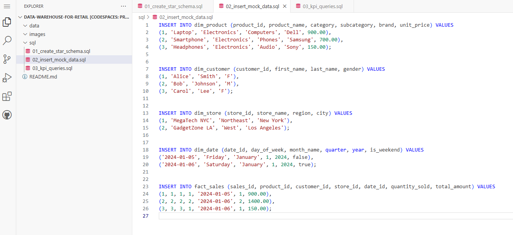
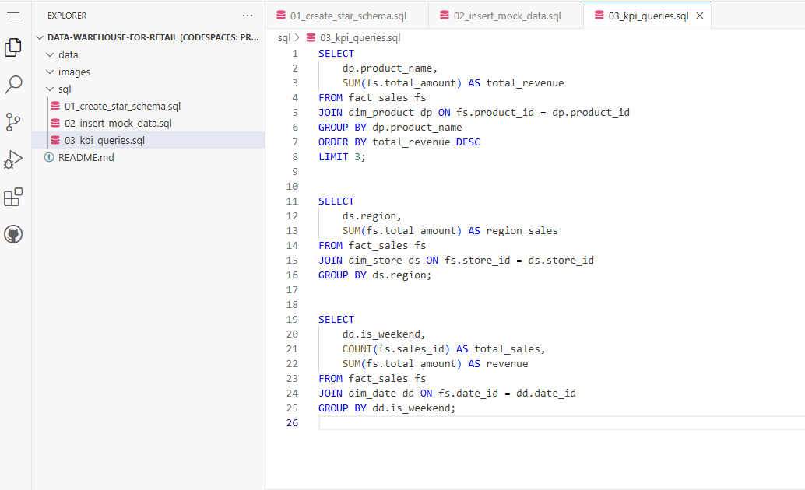
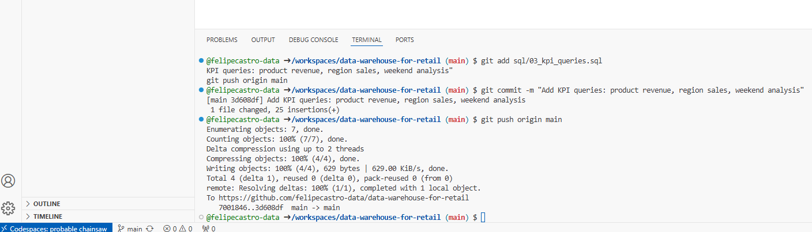

# 🛒 Data Warehouse for Retail

This project simulates a star-schema data warehouse for a fictional retail company. It includes sales, customers, products, time, and location dimensions designed for analytics and reporting. The warehouse is built using T-SQL and is ideal for running performance-optimized queries and KPIs.

---

## 📌 Problem Statement

Retail companies must analyze large volumes of transactions to optimize inventory, understand customer behavior, and monitor profitability across regions and time periods. This project structures that raw data into a star schema for fast, reliable querying.

---

## 🧱 Schema Design

The star schema consists of:
- `fact_sales`: central sales transaction table
- `dim_product`: product details
- `dim_customer`: customer demographics
- `dim_store`: location info
- `dim_date`: time dimension

---

## 🔁 Workflow

1. Model schema using ERD principles
2. Generate SQL DDL statements to create tables
3. Populate with sample data
4. Run optimized SQL queries for KPIs

---

## 📂 Project Structure

```
data-warehouse-for-retail/
├── sql/
│   ├── 01_create_star_schema.sql
│   ├── 02_insert_mock_data.sql
│   └── 03_kpi_queries.sql
├── data/
│   ├── fact_sales.csv
│   ├── dim_customer.csv
│   └── ...
├── images/
│   └── (screenshots of queries or schema)
└── README.md
```

---

## 🖼️ Visual Overview

### 1. Star Schema Creation (SQL)


### 2. Insert Mock Data


### 3. KPI Queries


### 4. Git Terminal Commands


---

## 🚀 Key Features

- Star schema modeling with dimension & fact tables
- Optimized joins for analytics
- Sample insights: top customers, product sales, regional trends
- Ready for Power BI or reporting integration

---

## 📊 Example Queries

- Top 10 Products by Revenue
- Monthly Sales Trend
- Profit Margin by Store
- Customer Lifetime Value

---

## 🏅 Author & Certifications

**Felipe Castro**
Senior Data Analytics Engineer @ EPAM Systems

- 🏅 **[DP-700: Microsoft Certified: Fabric Data Engineer Associate](https://learn.microsoft.com/api/credentials/share/en-us/FelipeCastro-8026/96572499DF943EBC?sharingId=13D660F56C1DFFA3)**
- 🏅 **[DP-600: Microsoft Certified: Fabric Analytics Engineer Associate](https://learn.microsoft.com/api/credentials/share/en-us/FelipeCastro-8026/6C5A2F5A8A5864FC?sharingId=13D660F56C1DFFA3)**
- 🏅 **[PL-300: Microsoft Certified: Power BI Data Analyst Associate](https://learn.microsoft.com/api/credentials/share/en-us/FelipeCastro-8026/F853AABE365874B3?sharingId=13D660F56C1DFFA3)**

---

## 🚀 Tools & Tech


